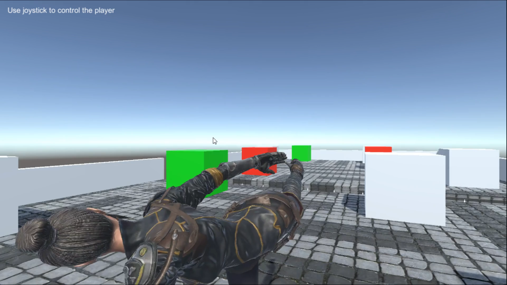
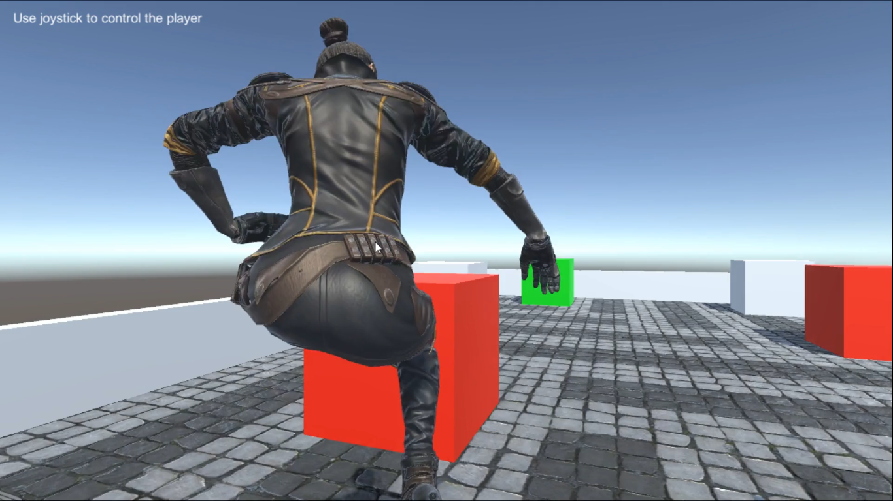

# Third Person Game


This game is built at the third person within Unity3D.
It's a simple game made to learn Unity engine.

## Table of contents
1. [Reference](#ref)
2. [Final result](#result)
    1. [Video](#video)
    2. [Screenshots](#images)
3. [Game installation](#install)

## Reference <a id = "ref"></a>
The project can be found via the link below :<br/>
- https://gitlab.com/obrymec/simple_cube_game

## Final result <a id = "result"></a>
This is the final result of the project :<br/>
### Video <a id = "video"></a>
[](https://youtu.be/M46gpZW6Vdw)

### Screenshots <a id = "images"></a>



## Game installation <a id = "install"></a>
- Download <strong><i>game.7z</i></strong> or
run the command line below :
```sh
git clone git@github.com:obrymec/third_person_game.git third_person_game/
```
- Decompress <strong><i>game.7z</i></strong> file;
- Run <strong><i>game.exe</i></strong> file.

<strong><ins>Pay Attention</ins></strong> :
<i>This game is built for Windows only.
Make sure you to open it on Windows
OS only</i>.

Enjoy :)
